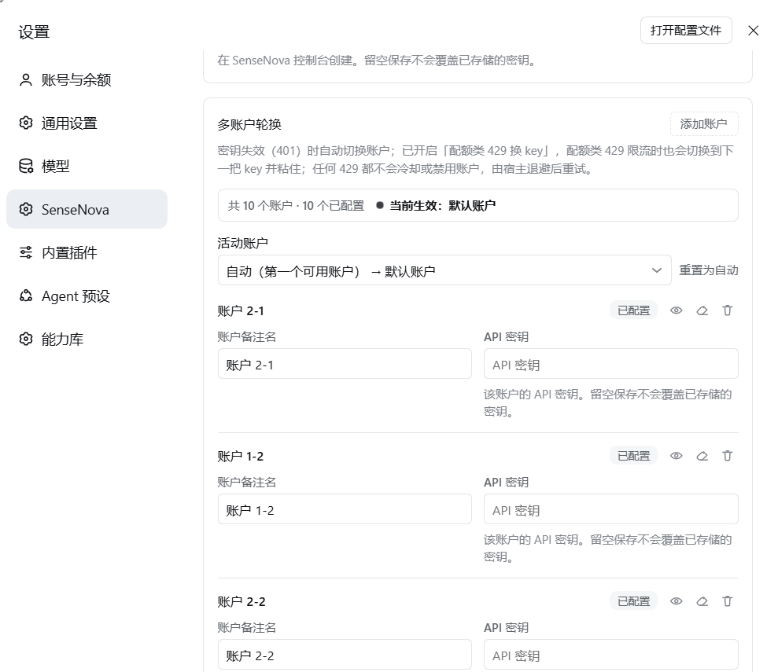
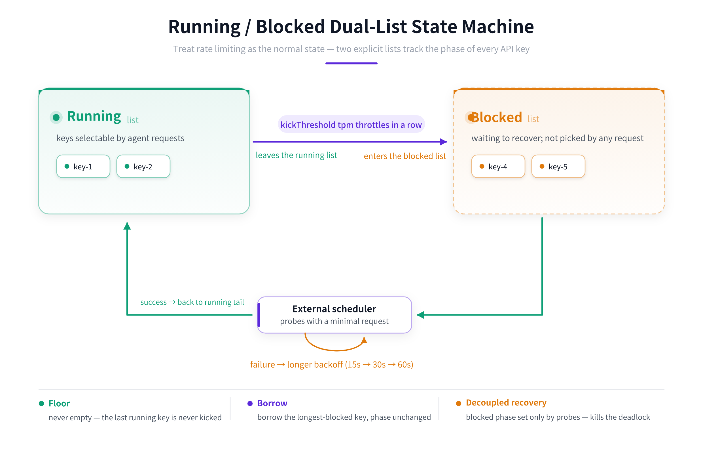

# dsh-sensenova-freeapi

[简体中文](./README.md) ｜ **English**

dsh-sensenova-freeapi is an unofficial **DeepSeek Harness** (DSH) LLM provider plugin. Built on the **everything-is-a-plugin** architecture, it registers the `sensenova` provider route to connect to **SenseNova** (an OpenAI-compatible API). It ships with **multi-account API-key rotation**, a **running/blocked dual-list state machine**, a live model catalog, and a Models-page settings panel, turning channel rate-limit spam into a stable service.

<p align="center">
  
</p>


> Reference implementation: [`@mars-sea/dsh-commandcode-provider`](https://github.com/Mars-Sea/dsh-commandcode-provider) (MIT). This plugin keeps only the multi-account connectivity; the login flow, usage dashboard, plan window, and CLI tooling are all trimmed away.

---

## 🚀 Quick Start: Sign Up, Get Keys, Configure Accounts

### 1. Create a SenseNova account

Sign up and log in at [https://platform.sensenova.cn/login](https://platform.sensenova.cn/login).

### 2. Issue multiple API keys from the console

Open the console at [https://platform.sensenova.cn/console](https://platform.sensenova.cn/console), then create keys under **API Key management**. Each API key carries its own rate-limit allowance, so issuing several keys raises your throughput considerably.

> 📷 Account configuration screen (where to issue multiple API keys):

<p align="center">
  
</p>

### 3. Register ≥ 2 accounts (recommended)

SenseNova limits are **account- / endpoint-scoped** — multiple keys inside the *same* account share a single quota bucket. So spreading keys across **≥ 2 accounts** is what actually bypasses the single-account bottleneck.

- **2 accounts are enough for ordinary users**; add more only if you need higher throughput.
- This plugin's running/blocked dual-list + account rotation is built exactly for the multi-account case.

### 4. Enter API keys in alternating-account order

When configuring `accounts[]` in the Models page, interleave keys from **different accounts**. For two accounts `A`, `B`, order them like:

```
A1  B1  A2  B2  A3  B3  …  (i.e. 121212 alternating)
```

This naturally staggers every key so rotation never spins inside one account, greatly lowering the chance of hitting a single account's ceiling.

- Issue as many keys as you need; the open-source author runs **2 accounts × 10 API keys** (5 per account) for the best balance.

### 5. Recommended models

The following are taken from long-running measurements (2026-09), ordered by use case:

| Model | Capability / Notes | Rating |
|---|---|---|
| **`deepseek-v4-flash`** | **First choice.** DeepSeek V4 Flash (0731); only *slightly* slower than the official DeepSeek API at any time of day; low-cost, 1M context, thinking + tool-calling | ⭐⭐⭐⭐⭐ |
| `sensenova-6.8-flash-lite` | `6.8-flash-lite` uses a lightweight dedicated quota pool, has **real vision** (the only reliable one for reading images/screenshots), and the fastest wall-clock (26.6× speedup) | ⭐⭐⭐⭐⭐ (vision first) |
| `kimi-k3` | Moonshot flagship multimodal agent; native vision + 1M context; good for long-horizon coding and knowledge work | ⭐⭐⭐⭐ |
| `glm-5.2` | Zhipu long-horizon model; **highest sustained throughput** (201% faster than `deepseek-flash`, 45% lower latency), but **no vision** (hallucinates on images) | ⭐⭐⭐⭐ (text/long-run) |
| ⚠️ `deepseek-flash` (DeepSeek V4.1 Flash) | **Not recommended:** very slow at peak, and only reaches ≤ half the official API speed even off-peak | ❌ |

> 💡 **Bottom line:** use `deepseek-v4-flash` for daily/code/agent work; `sensenova-6.8-flash-lite` when you need image understanding; `glm-5.2` for pure-text maximum throughput. **Avoid `deepseek-flash` (V4.1).**

> 🔭 **Pairing recommendation (vision assist):** run the main model on `deepseek-v4-flash` (fast, stable, low-cost) and leave image recognition to the vision-assist plugin — install [`dsh-sensenova-vision-aid`](https://github.com/modesthub/dsh-sensenova-vision-aid), which spawns a child agent switched to the SenseNova vision model (`sensenova-6.8-flash-lite` → `deepseek-flash` → `kimi-k3` failover) and **reuses this plugin's key automatically** (default `reuseFreeapiCredentials=true`, no second key needed). **Best combination: `deepseek-v4-flash` for text/code/agent work + vision-aid for images — fast and reliable.**

---

## Core idea: design around throttling as a norm

SenseNova imposes **TPM / RPM concurrency and quota limits** per key, and a burst over the limit returns `429`. Most plugins just retry, which collapses into a **positive-feedback deadlock** under sustained throttling: the counter only resets on 2xx → short-circuiting yields zero success → the counter never resets → short-circuit never lifts → the process must be restarted.

This plugin flips the thinking: **throttling is not an accident, it is the steady state.** Two explicit lists manage the state of every API key:

### Running / Blocked dual-list state machine

<p align="center">
  
</p>

Three non-negotiable properties (the essential difference from the legacy whole-pool short-circuit):

1. **Floor** — when only 1 key remains in running, it is never kicked ⇒ the pool never empties and agent requests always go out.
2. **Borrow** — when running candidates are all excluded, borrow the *longest-blocked* key temporarily (**without changing its phase**).
3. **Recovery decoupled from requests** — a blocked key's phase is decided **only by probe results**, never polluted by "zero success", so it can be revived at any time. **This is what roots out the old deadlock.**

> Why probing must exist: agent requests only ever target running keys — a blocked key is never hit. Unless someone probes it, it can never recover. The scheduler probes once every `probeInitialMs` (default 15s, the same order as the request-bucket refill cycle) with a minimal request, and revives the key on success.

---

## Dual-account rotation

- Supports `1 default account + extra accounts` (`accounts[]`, each with its own `apiKeyEnv` credential ref), sharing one base URL.
- Requests rotate in **alternating-account** order; a key excluded by `exclude` (401 or quota rotation) wraps around to **the next position**, avoiding the legacy "first-two ping-pong, key #3+ never used" bug.
- **Quota-type 429s sticky-switch keys**: the rejected key stays usable and the next request continues from the next key, spreading one key's burst throttle over all keys.
- Only **401 (invalid credential) permanently disables** a key until its credential changes; 429 never cools down or disables (throttling is normal, not an unhealthy account).

---

## Why it "runs stably over the long term"

None of the key parameters are guesses; they were **calibrated in long-running measurement**:

| Measured item | Conclusion | Basis |
|---|---|---|
| Retry-After cap | raised to `60_000ms` (original 3000ms mismatched the TPM 60s window) | long-run |
| Queue timeout | default 60s, aligned with the TPM window; queueing must be bounded | design D4/D6 |
| Dual-list state machine | replaces the whole-pool-saturation positive-feedback deadlock | refactor |
| Wrap-around rotation fix | after an exclusion, must wrap from the next position | 9265 logged 429s |
| Probe interval | 15s start, ×2 backoff, 60s cap | measurement |

---

## Feature overview

### 🧠 Dual-list key pool (running / blocked)
- Pool-level singleton, shared across sessions: a key's quota is a global property and must not be session-isolated.
- Consecutive-throttle kick-out, floor-never-empty, longest-blocked borrowing, probe recovery, 15/30/60s backoff — all configurable.
- Each key's state (phase, strikes, blockedSince, probeAttempts) is read-only in the settings page.

### 🔄 Dual-account rotation
- Default account + extra accounts, same base URL.
- Wrap-around rotation + sticky key-switch on quota-type 429s + permanent disable on 401.
- A disabled key auto-recovers when its credential changes.

### 📋 Error log table (read-only diagnostic block)
- Every throttle becomes a structured event, written asynchronously — **never blocks, never throws**.
- Fields: `time / model / error.code / account fingerprint / retryFloorMs / probeHits / poolRunning / poolBlocked / rotated / attempt`.
- Keys live only in memory; logs write only **sha256 fingerprints**; raw keys never touch disk or leave the machine.

### 📊 "Current model + all parameters" panel (read-only visualization)
- Answers: **which model am I using? what does it support? which parameters can I change?**
- Sourced from the host's actual parsing plus multiple measurement rounds.

---

## Installation

```bash
# Install from a local path (recommended for validating against DSH)
dsh plugin --profile <name> add dsh-sensenova-freeapi

# After publishing to GitHub
dsh plugin --profile <name> add github:modesthub/dsh-sensenova-freeapi

# After publishing to npm
dsh plugin --profile <name> add dsh-sensenova-freeapi
```

Then configure SenseNova on the **Models** page:
- Default credential env var: `SENSENOVA_API_KEY`
- Default base URL: `https://token.sensenova.cn/v1`

---

## Configuration

| Field | Type | Default | Description |
| --- | --- | --- | --- |
| `apiBase` | string | `https://token.sensenova.cn/v1` | shared base URL for all accounts |
| `apiKeyEnv` | credential-ref | `SENSENOVA_API_KEY` | credential ref for the default account |
| `accounts[]` | array | `[]` | extra accounts: `{ id, label, apiKeyEnv }` |
| `activeAccount` | string | `""` | preferred account id; empty = auto / first usable |
| `quotaRotation` | bool | false | sticky key-switch on quota-429 |
| `concurrency` | int | 1 | per-key concurrency gate (FIFO queue above) |
| `queueTimeoutMs` | int | 60000 | queueing wait cap |
| `poolPolicy.kickThreshold` | int | 2 | consecutive TPM throttles to kick out of running |
| `poolPolicy.probeInitialMs` | int | 15000 | first probe interval |
| `poolPolicy.probeBackoffFactor` | int | 2 | probe backoff multiplier |
| `poolPolicy.probeMaxMs` | int | 60000 | probe interval cap |
| `poolPolicy.capacity` | int | 10 | pool capacity cap |
| `errorLog` | bool | true | whether to record throttle events |

> API keys are always stored through the DSH credentials service — **never written to logs, never sent to the model**.

---

## Development

```bash
pnpm install
pnpm run typecheck
pnpm run build    # tsdown → lib/
pnpm test         # node --import tsx --test tests/**/*.test.ts
```

---

## License

MIT