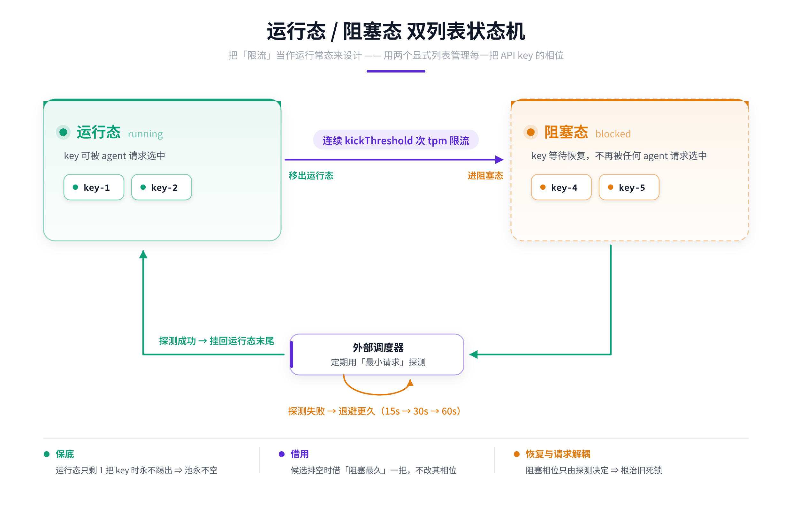

# dsh-sensenova-freeapi

**简体中文** ｜ [English](./README.en.md)

dsh-sensenova-freeapi 是一个非官方的 **DeepSeek Harness**（DSH）LLM 提供商插件，基于**一切皆插件（everything-is-a-plugin）**架构注册 `sensenova` 提供商路由，对接 **SenseNova**（OpenAI 兼容 API）。它内置**多账户 API-Key 轮换**、**运行态 / 阻塞态双列表状态机**、实时模型目录与 Models 页设置面板，把渠道限流从「错误轰炸」变成「稳定服务」。

<p align="center">
  
</p>


> 参考实现：[`@mars-sea/dsh-commandcode-provider`](https://github.com/Mars-Sea/dsh-commandcode-provider)（MIT）。本插件只保留多账户连接能力；登录流程、用量面板、套餐窗口、命令行工具均已裁剪。

---

## 🚀 快速上手：注册、申请 Key、配置账户

### 1. 注册 SenseNova 账号

到 [https://platform.sensenova.cn/login](https://platform.sensenova.cn/login) 注册并登录（支持手机号 / 邮箱）。

### 2. 在控制台申请多个 API Key

进入控制台 [https://platform.sensenova.cn/console](https://platform.sensenova.cn/console)，在「API Key 管理」中创建密钥。每个 API Key 对应一次限流额度，多申请几把即可显著提升吞吐。

> 📷 账户配置界面示意（控制台申请多个 API Key 的位置）：

<p align="center">
  
</p>

### 3. 建议注册 ≥ 2 个账户

SenseNova 的限流额度是**账户级 / 端点级**的（同一账户内多把 Key 共享同一个额度桶），因此**把 API Key 分散到 ≥ 2 个账户**才能绕开单账户瓶颈。

- **2 个账户已足够普通用户使用**；需要更高吞吐可继续增加。
- 本插件运行态/阻塞态双列表 + 账户轮换就是为「多账户」设计的。

### 4. 建议 API Key 输入顺序：按账户交替

在 Models 页配置 `accounts[]` 时，把**不同账户的 Key 交替排列**，例如有 2 个账户 `A`、`B`，则填写顺序为：

```
A1  B1  A2  B2  A3  B3  …（即 121212 交替）
```

这样每把 Key 之间天然错位，轮换时不会在同一账户内打转，显著降低单账户触顶概率。

- 可以按需申请更多 Key；开源作者实测使用的是 **2 个账户 10 个 API Key**（每账户 5 把）达到最优平衡。

### 5. 推荐模型

以下结论来自垃圾站长程实测校准（2026-09），按首选用途排序：

| 模型 | 能力 / 说明 | 推荐度 |
|---|---|---|
| **`deepseek-v4-flash`** | **首选**。DeepSeek V4 Flash（0731），任意时段使用都只比 DeepSeek 官方 API **慢一点点**；低成本、1M 上下文、支持思考/工具调用 | ⭐⭐⭐⭐⭐ |
| `sensenova-6.8-flash-lite` | `6.8-flash-lite` 走轻量专属额度池，**真视觉**（读图、截图唯一可靠）、墙钟最快（26.6× 提速） | ⭐⭐⭐⭐⭐（读图首选） |
| `kimi-k3` | 月之暗面旗舰多模态 Agent，原生态视觉 + 1M 上下文，适合长程编程/知识工作 | ⭐⭐⭐⭐ |
| `glm-5.2` | 智谱长程 Agent，**持续吞吐最高**（比 `deepseek-flash` 快 201%、延迟快 45%），但**无视觉**（读图会幻觉） | ⭐⭐⭐⭐（纯文本/长程） |
| ⚠️ `deepseek-flash`（DeepSeek V4.1 Flash） | **不建议**：实测高峰期很慢、低峰期也只能达到官网 API 一半速度及以下 | ❌ |

> 💡 **一句话结论**：日常/代码/Agent 用 `deepseek-v4-flash`；要读图用 `sensenova-6.8-flash-lite`；追求极限文本吞吐且不读图用 `glm-5.2`。**不要用 `deepseek-flash`（V4.1）**。

---

## 核心思想：把「限流」当作常态设计

SenseNova 渠道对单 key 存在 **TPM / RPM 并发与配额限制**，瞬时超限会抛 `429`。多数插件的做法是报错 + 重试，连续限流时陷入**正反馈死锁**：计数只在 2xx 清零 → 短路导致零成功 → 计数永不清零 → 短路永不解除 → 只能重启进程。

本插件换了一个思路：**限流不是事故，是运行常态**。用两个显式列表管理每一把 API Key 的状态：

### 运行态 / 阻塞态双列表状态机

<p align="center">
  
</p>

三条不可让步的性质（与旧「全池短路」机制的本质区别）：

1. **保底**：运行态只剩 1 把 key 时永不踢出 ⇒ 池永不空，Agent 请求永远发得出去。
2. **借用**：运行态候选被排除排空时，从阻塞态借「阻塞最久」的一把临时使用（**不修改其相位**）。
3. **恢复与请求解耦**：阻塞态 Key 的相位**只由探测结果决定**，不受「零成功」污染，随时能把 key 救回运行态。**这是根治旧死锁的关键。**

> 为什么必须探测恢复：Agent 请求只会选中运行态的 Key，阻塞态的 Key 不会被任何请求命中。若无人试探，它就永远回不来——调度器每隔 `probeInitialMs`（默认 15s，恰好量级匹配请求数桶恢复周期）用一次最小请求探一下，成功即复活。

---

## 双账户轮换：交替使用，降低报错与限流

- 支持 `1 个默认账户 + 多个额外账户`（`accounts[]`，各配独立 `apiKeyEnv` 凭据引用），共享同一 base URL。
- 请求按「账户交替」轮换：被 `exclude`（401 或配额轮换）的 Key 会从**下一位置环回**，避免旧实现「前两把反复、第 3+ 把轮不到」的问题。
- **配额类 429 粘性换 Key**：被拒的 Key 保持可用状态，下次从下一把继续，把单 Key 瞬时限流摊到多把。
- **401（凭据无效）才永久禁用**该 Key，直到再 + 凭据被修改；429 一律不冷却、不禁用（渠道限流属于常态，不代表账号异常）。

---

## 为什么能「长时间稳定运行」——长程实测支撑

本项目所有关键参数都不是拍脑袋，而是**在长程运行中实测校准**的：

| 实测项 | 结论 | 依据 |
|---|---|---|
| Retry-After 上限 | 提到 `60_000ms`（原 3000ms 与 TPM 60s 窗口量级不符） | 长程实测 |
| 排队超时 | 默认 60s，与 TPM 窗口对齐，排队必须有界 | design D4/D6 实测 |
| 双列表状态机 | 取代「全池饱和短路」正反馈死锁 | 重构 |
| 环回轮换修复 | 排除项后必须从下一位置环回 | 9265 条 429 日志统计 |
| 探测间隔 | 15s 起、×2 退避、60s 封顶 | 实测 |

---

## 功能一览

### 🧠 双列表 Key 池（运行 / 阻塞）
- 池级单例、跨会话共享：Key 的额度是全局属性，不该被会话隔离。
- 连续限流踢出、保底不空、借用最久阻塞、探测恢复、15/30/60s 退避，全部可配置。
- 每把 Key 状态（相位、strikes、blockedSince、probeAttempts）在设置页只读展示。

### 🔄 双账户轮换
- 默认账户 + 多额外账户，同 base URL。
- 环回轮换 + 配额类 429 粘性换 Key + 401 永久禁用。
- 被禁用 Key 凭据修改后自动恢复。

### 📋 错误记录表（只读诊断区块）
- 每次限流落成一条结构化事件，异步写入、**绝不阻塞、绝不抛出**。
- 字段：`time / model / error.code / account fingerprint / retryFloorMs / probeHits / poolRunning / poolBlocked / rotated / attempt`。
- 密钥只存内存、日志只写 **sha256 指纹**，Key 原文永不落盘、永不出境。

### 📊 「当前模型 + 全部参数」面板（只读可视化）
- 回答三个问题：**我现在用的是哪个模型？它支持什么？哪些参数可以改？**
- 数据来自宿主实际解析 + 多轮实测校准。

---

## 安装

```bash
# 本地路径装入（推荐用于接入 DSH 验证）
dsh plugin --profile <name> add /path/to/dsh-sensenova-freeapi

# GitHub 发布后
dsh plugin --profile <name> add github:你的用户名/dsh-sensenova-freeapi

# 或 npm 发布后
dsh plugin --profile <name> add dsh-sensenova-freeapi
```

然后在「模型」页配置 SenseNova：
- 默认凭据环境变量：`SENSENOVA_API_KEY`
- 默认 base URL：`https://token.sensenova.cn/v1`

---

## 配置项

| 字段 | 类型 | 默认 | 含义 |
| --- | --- | --- | --- |
| `apiBase` | string | `https://token.sensenova.cn/v1` | 所有账户共享的 base URL |
| `apiKeyEnv` | credential-ref | `SENSENOVA_API_KEY` | 默认账户凭据引用 |
| `accounts[]` | array | `[]` | 额外账户：`{ id, label, apiKeyEnv }` |
| `activeAccount` | string | `""` | 首选账户 id；空 = 自动 / 首个可用 |
| `quotaRotation` | bool | false | 配额类 429 是否粘性换 Key |
| `concurrency` | int | 1 | 每 Key 并发闸上限（达限排队 FIFO） |
| `queueTimeoutMs` | int | 60000 | 排队等待上限 |
| `poolPolicy.kickThreshold` | int | 2 | 连续多少次 tpm 限流踢出运行态 |
| `poolPolicy.probeInitialMs` | int | 15000 | 首次探测间隔 |
| `poolPolicy.probeBackoffFactor` | int | 2 | 探测失败退避倍率 |
| `poolPolicy.probeMaxMs` | int | 60000 | 探测间隔上限 |
| `poolPolicy.capacity` | int | 10 | 池容量上限 |
| `errorLog` | bool | true | 是否记录限流事件到错误日志 |

> API Keys 一律经 DSH 凭据服务存储，**永不写入日志、永不发送给模型**。

---

## 开发

```bash
pnpm install
pnpm run typecheck
pnpm run build    # tsdown → lib/
pnpm test         # node --import tsx --test tests/**/*.test.ts
```

---

## 许可证

MIT